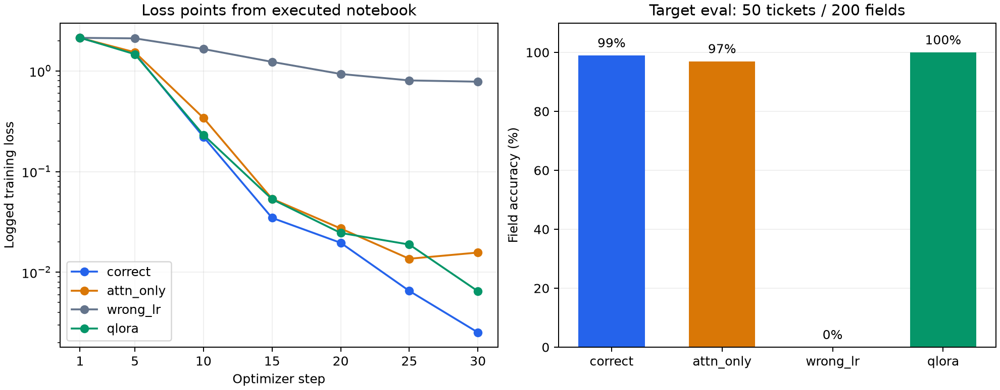

# Lab 21 — LoRA cho phân loại ticket CSKH tiếng Việt

**Họ tên**: Vũ Đức Minh
**MSSV**: 2A202602895
**Ngày báo cáo**: 08/10/2026.
**Tài khoản repo**: MinMinhMin.
**Trạng thái định tính**: Đã có ≥5 đối chiếu đầy đủ và ≥2 ca FT thua baseline.

## 1. Bài toán, lựa chọn và phạm vi thí nghiệm

Bài toán là chuyển một ticket chăm sóc khách hàng tiếng Việt thành JSON có bốn trường: `intent`, `urgency`, `product`, `sentiment`. Mục tiêu của lab là kiểm tra liệu LoRA có cải thiện năng lực tác vụ so với chính base model được prompt tốt, đồng thời phát hiện sự suy giảm ở các câu hỏi phổ thông. Vì vậy, một kết quả target tốt chưa đủ để kết luận mô hình nên được triển khai.

Tôi sử dụng `unsloth/Qwen3.5-4B` và corpus mặc định gồm 250 ticket tổng hợp. Lựa chọn này phù hợp với tier T4 của lab và cho phép đối chiếu trực tiếp các cấu hình trong NB3–NB4. Dữ liệu có nhãn rõ ràng, đầu ra có cấu trúc và scorer chạy độc lập với LLM judge, giúp kiểm tra lỗi ở từng trường. Đây là corpus thực hành nhỏ; kết quả không đại diện cho toàn bộ ticket CSKH thực tế.

| Thành phần | Thiết lập của run |
|---|---|
| Nơi chạy | Kaggle, GPU T4×2 theo cấu hình session đã sử dụng |
| Base model | `unsloth/Qwen3.5-4B` cho cả baseline và fine-tune |
| Precision được ghi trong `runs.csv` | FP16; normalization và chunked loss được bảo vệ bằng FP32 |
| Corpus / split | 250 mẫu; 225 train / 25 val; seed 42 |
| Target eval / regression eval | 50 ticket / 15 câu hỏi phổ thông |
| `MASK_MODE` | `assistant-only` |
| `max_length` | 256; p95 đo được 98, max 101 |
| Batch / accumulation | 1 mẫu mỗi micro-batch, accumulation 16; batch hiệu dụng 16 |
| Ngân sách | 2 epoch; 30 optimizer update thực cho mỗi run |
| Generation | Greedy, `do_sample=False`, batch 4, `enable_thinking=False` |
| Giới hạn sinh | Target 160 token; regression 96 token |
| Repo thực hiện | https://github.com/MinMinhMin/Day21-Track3-Finetuning-Lab |

Các bản sửa cho Kaggle xử lý tương thích forward của Qwen3.5 với chunked loss TRL, chuyển tensor loss sang GPU chứa LM head, tính normalization/projection ổn định hơn và giảm loss scale khi preflight bị overflow. QLoRA vẫn giữ trọng số nền NF4 4-bit. Các đường baseline, train và eval cùng sử dụng bản sửa normalization. Chi tiết ở `docs/KAGGLE-FP16-FIX.md`.

Notebook đã thực thi `submission/evidence/notebooke0c9e5e333.executed.ipynb` xác nhận Python 3.13.15, Torch 2.11.0+cu128, Transformers 5.15.0, TRL 1.10.0, PEFT 0.20.0, Accelerate 1.14.0 và Tokenizers 0.22.2; commit repo `6c46c12`; GPU là hai Tesla T4. Mốc papermill bắt đầu 07:18:40 UTC, kết thúc 08:36:42 UTC ngày 08/10/2026. NB1–NB5 được log ở mức 4543 giây, khoảng 75,7 phút; thời gian notebook gồm setup/kiểm tra/upload khoảng 78,0 phút. Build `cu128` của Torch không thay thế việc ghi nhận phiên bản driver thực tế; log chưa ghi driver, phiên bản bitsandbytes hoặc revision checkpoint đầy đủ. Các trường runtime và mốc loss được trích vào `results/run_provenance.json`.

## 2. NB1 — Bằng chứng loss mask và chat template

`results/mask_proof.json` ghi nhận:

| Kiểm tra | Giá trị |
|---|---:|
| Câu trả lời được tính loss | `answer_is_supervised=true` |
| Câu hỏi được mask | `question_is_masked=true` |
| Số token supervised / tổng token trong mẫu kiểm tra | 39 / 94 |
| `supervised_fraction` | 0,4149 |

Đoạn giải mã các vị trí `labels != -100` là:

```text
</think>

{"intent": "doi_tra", "urgency": "trung_binh", "product": "balo laptop", "sentiment": "trung_tinh"}<|im_end|>
```

Phần system và câu hỏi của người dùng nằm trong `masked_preview`, không được tính loss. Mask có tính cả delimiter kết thúc phần assistant; do đó không mô tả nó là “chỉ các ký tự JSON”. Hai assert đúng và tỷ lệ supervised thấp hơn ngưỡng 0,95 của rubric cho thấy pipeline không huấn luyện toàn bộ prompt trong mẫu chứng minh này.

`results/template_check.json` có `ok=true`, `open_tag_present=true`, `body_present=true`: template giữ được một khối `<think>` có nội dung trong phép thử của NB1. Tuy nhiên, phép thử giữ template không chứng minh corpus train có reasoning trace chất lượng. Generation trong run tắt thinking, nên `valid_trace_rate=0` ở NB5 không đủ để kết luận reasoning-trace collapse.

`results/token_stats.json` đo trên 250 mẫu: mean 93,1; p50 93; p95 98; p99 100; max 101; `suggested_max_length=256`. Tier T4 dùng đúng 256. Giá trị này bao phủ độ dài lớn nhất của corpus hiện tại và không cắt mất đáp án theo thống kê đã đo.

## 3. NB2 — Baseline được đóng băng

Baseline (a) dùng prompt ngắn `Phân loại ticket sau.`. Baseline (b) bổ sung schema, tập nhãn hợp lệ, yêu cầu chỉ trả JSON và một ví dụ few-shot. Mốc (b) là đối thủ cần vượt. Baseline (c) là adapter `correct` được đánh giá ở NB5 với prompt ngắn.

Mốc NB2 lưu trong `results/baselines_frozen.json`, có `optimized_prompt_sha=719e74d3b6232053`, `n_target=50`, `n_regression=15`, `eval_limit=null`, `smoke_mode=false`. Prompt (b) không bị thay đổi so với bản dùng trong run. Checksum của eval target, eval regression và corpus gốc còn khớp `data/checksums.json`. Kiểm tra input cho thấy không có ticket eval trùng nguyên văn với train hoặc val; đây không phải kiểm tra khử nhiễm ngữ nghĩa đầy đủ.

Pipeline chạy NB2 trước NB3; các bảng baseline được giữ nguyên trong quá trình hoàn thiện hồ sơ. Không sửa prompt hoặc tập eval để làm adapter trông tốt hơn.

| Run | Target | Regression | Format | Latency (ms/mẫu) |
|---|---:|---:|---:|---:|
| (a) Base + naive prompt | 0,0000 | 0,6911 | 0,0000 | 3661,8 |
| (b) Base + optimized prompt | 0,7650 | 0,6911 | 1,0000 | 1117,3 |
| (c) LoRA `correct` | 0,9900 | 0,3333 | 1,0000 | 1518,0 |

Nguồn: `results/verdict.json`; baseline không làm tròn nằm trong `results/baselines_frozen.json`.

Prompt tối ưu nâng target từ 0 lên 0,765 và format từ 0 lên 1. Đây là bằng chứng prompt engineering đã tạo ra một baseline mạnh hơn. Điểm 0 của baseline (a) không chứng minh base model hoàn toàn không hiểu ticket: scorer có thể không chấm được câu trả lời thiếu JSON phù hợp. Run không lưu output đầy đủ của (a), nên chưa phân biệt được các dạng lỗi của baseline này.

## 4. NB3–NB4 — Bốn run có cùng ngân sách

| Run | Placement | r / alpha | Trainable params | LR | Base | Train loss | Train (s) | Peak VRAM ghi nhận (GiB) |
|---|---|---|---:|---:|---|---:|---:|---:|
| `correct` | Text-decoder linear, 12 tên module | 16 / 32 | 32.464.896 | 0,0001 | 16-bit | 0,3176 | 905,4 | 6,87 |
| `attn_only` | q,v; 2 tên module | 283 / 566 | 32.456.704 | 0,0001 | 16-bit | 0,3507 | 765,9 | 6,86 |
| `wrong_lr` | Text-decoder linear, 12 tên module | 16 / 32 | 32.464.896 | 0,00001 | 16-bit | 1,2524 | 870,1 | 7,88 |
| `qlora` | Text-decoder linear, 12 tên module | 16 / 32 | 32.464.896 | 0,0001 | NF4 4-bit | 0,3226 | 957,7 | 5,12 |

Nguồn: `results/runs.csv`. Cột `final_loss` của file này là `TrainOutput.training_loss`, tức loss tổng hợp của quá trình train, không phải loss tại update cuối. Không dùng cột này để xếp hạng năng lực tác vụ.

Cả bốn run có `max_steps=30`, `optimizer_steps_attempted=30`, `optimizer_updates=30`, `amp_skipped_steps=0`. QLoRA giảm scale 128 → 64 trong preflight (`preflight_scale_backoffs=1`); scale dùng khi train và scale cuối đều là 64. Ba run 16-bit dùng scale 128. Preflight không thực hiện optimizer update, nên sự giảm scale này không làm QLoRA mất một bước train.

`attn_only` khác `correct` ở placement và tăng rank như một điều chỉnh cần thiết để khớp ngân sách: chênh 8.192 tham số, khoảng 0,0252%, thấp hơn ngưỡng 5%. `wrong_lr` giữ cấu hình và giảm LR 10 lần. `qlora` thay trọng số nền bằng 4-bit, giữ placement, rank, LR và số update; cần khai báo thêm khác biệt về kernel tính toán và scale số học. Chỉ một seed và một ngân sách được đo, nên các kết quả là bằng chứng trong thiết lập này.

Log NB3 xác nhận text decoder có 32 layer: 24 `linear_attention` và 8 `full_attention`, với `full_attention_interval=4`. Vì mô hình có kiến trúc attention hỗn hợp, placement chỉ chọn `q_proj`/`v_proj` không phủ các projection của phần linear attention. Placement `text-linear` dùng 12 tên module được log: `down_proj`, `gate_proj`, `in_proj_a`, `in_proj_b`, `in_proj_qkv`, `in_proj_z`, `k_proj`, `o_proj`, `out_proj`, `q_proj`, `up_proj`, `v_proj`. Đây là lý do cần kiểm tra module thật của checkpoint thay vì suy ra placement từ một mô hình attention thông thường.

### 4.1. Vị trí so với rank

| Run | Target ở NB5 | Format | Latency (ms/mẫu) |
|---|---:|---:|---:|
| `correct` | 0,9900 | 1,0000 | 1518,0 |
| `attn_only` | 0,9700 | 1,0000 | 1014,2 |
| `wrong_lr` | 0,0000 | 0,0000 | 5585,6 |
| `qlora` | 1,0000 | 1,0000 | 1834,6 |

Nguồn: `results/autopsy.json`. Thứ tự theo target là `qlora > correct > attn_only > wrong_lr`. Thứ tự theo train loss lại đặt `correct` trước `qlora`, cho thấy chỉ số train không thể thay thế eval tác vụ.

Dù rank attention-only tăng lên 283, ngân sách tham số gần bằng `correct`, target của nó vẫn thấp hơn 2 điểm phần trăm. Kết quả phù hợp với việc placement rộng trong text decoder có lợi ở run này; tăng rank của một tập module hẹp không tái tạo được mọi đường thích nghi của placement rộng. Tuy vậy, attention-only vẫn đạt 0,97 và có latency thấp hơn. Khoảng cách trên 50 ticket không đủ để tuyên bố placement rộng luôn thắng; chưa có nhiều seed hoặc kiểm định bất định. Thí nghiệm đã loại được chênh lệch ngân sách tham số lớn, nhưng chưa phải một cuộc quét rank độc lập.

### 4.2. Thang learning rate

`wrong_lr` có train loss tổng hợp 1,2524, cao hơn 0,3176 của `correct`, và target/format đều bằng 0 ở eval. Với cùng 30 update, LR 0,00001 chưa tạo được hành vi JSON đủ để scorer chấm tác vụ. Đây là bằng chứng tác động của LR trong ngân sách ngắn này, không chứng minh LR nhỏ không thể học nếu tăng thời gian train.

Nếu chỉ nhìn train loss, có thể nhầm cấu hình này với lỗi mask hoặc kết luận LoRA không thích hợp. Các run có mask chung và adapter hữu hạn giúp tách lỗi số học khỏi kết quả tác vụ. Notebook đã thực thi lưu loss tại step 1, 5, 10, 15, 20, 25 và 30. `wrong_lr` giảm từ 2,132 xuống 0,7822; `correct` giảm từ 2,132 xuống 0,002523 ở các mốc log tương ứng. LR nhỏ vẫn tạo ra sự học theo loss, nhưng chậm hơn rõ rệt trong ngân sách này. Các mốc ở hình dưới được trích từ log thật trong `run_provenance.json`, không nội suy ra loss của mọi micro-batch. Output bị format sai và target sai cũng chưa chứng minh riêng từng trường chưa được mô hình hiểu.



*Hình 1. Trái: loss được log tại các mốc optimizer step, trục dọc logarithmic; mỗi điểm sau step đầu là giá trị tổng hợp của khoảng log. Phải: field accuracy trên cùng 50 ticket. Nguồn: `results/run_provenance.json`, `results/autopsy.json`.*

### 4.3. QLoRA: bộ nhớ, chất lượng và chi phí

QLoRA đạt target 1,00, cao hơn `correct` 0,01; cả hai có format 1. Số đo VRAM ghi nhận giảm từ 6,87 xuống 5,12 GiB, chênh 1,75 GiB, khoảng 25,47%. Tuy nhiên, `peak_vram_gb()` chỉ đo `torch.cuda.max_memory_allocated()` trên GPU hiện hành; đây không phải tổng bộ nhớ hai GPU, không phải số từ `nvidia-smi`, và không thể khái quát thành phần trăm tiết kiệm tổng hệ thống. Placement tự động của model cũng có thể khác giữa các run.

Chi phí đo được là train tăng 52,3 giây, khoảng 5,78%, và latency target tăng 316,6 ms/mẫu, khoảng 20,86% so với `correct`. Những số đo này phụ thuộc phần cứng, placement và độ dài đầu ra. Trên bộ target nhỏ hiện tại, số liệu không ủng hộ khẳng định QLoRA làm giảm chất lượng target của dòng model này. Chênh lệch 0,01 chỉ tương ứng hai trường nhãn trên 200 trường được chấm. Các contrast chưa được đánh giá regression trong NB5, vì vậy không thể suy ra QLoRA sẽ vượt cổng hồi quy hoặc phù hợp triển khai hơn `correct`.

## 5. NB5 — Bốn nhóm đánh giá và phán quyết

**Phán quyết gốc: FAILED.** `target_delta=+0,2250`, `regression_delta=-0,3577777778`; tolerance regression là 0,02. File `results/verdict.json` chỉ ra sự giảm khả năng chung là nguyên nhân thất bại.

Target của `correct` tăng 22,5 điểm phần trăm so với baseline (b), tương ứng tăng từ 153/200 lên 198/200 trường đúng. Trong `qualitative.json`, 48 ticket có score 1 và hai ticket có score 0,75, nên exact match toàn bộ ticket là 48/50 = 96%; không viết rằng “99% ticket đúng hoàn toàn”. Format vẫn là 1: theo scorer của lab, đầu ra được trích xuất/parse thành object có đủ khóa. Scorer dùng parser linh hoạt, nên chỉ số này không chứng minh mọi output luôn là JSON thuần, không kèm văn bản ngoài object.

Regression giảm từ 0,6911111111 xuống khoảng 0,3333, tức 35,78 điểm phần trăm theo keyword recall, lớn hơn mức cho phép. Vì vậy không thể kết luận adapter giữ được khả năng chung dù nó đã chuyên môn hóa rất tốt cho triage. Dữ liệu train chủ yếu là ticket JSON, phù hợp với giả thuyết thích nghi quá mạnh theo tác vụ và quên khả năng trả lời phổ thông. Tuy nhiên, metric là keyword recall trên 15 câu hỏi, không phải một benchmark tổng quát về tri thức; sai format, diễn đạt khác hoặc câu trả lời không chứa đúng từ khóa cũng có thể làm điểm giảm. Lượt inference bổ sung hiện đã lưu output regression đầy đủ. Ở `regression[1]`, FT trả `{"content"}` thay vì tên hai đại dương; ở `regression[7]`, FT sinh nhãn ticket và các đoạn `user`/`assistant` thay vì lợi ích tập thể dục. Hai ca này cho thấy lỗi trả lời thực tế ngoài miền ticket, không chỉ là khác cách diễn đạt khiến thiếu từ khóa. Chúng phù hợp với giả thuyết hành vi JSON của tác vụ train lấn sang câu hỏi phổ thông, nhưng chưa chứng minh riêng một cơ chế quên tri thức bên trong mô hình.

Latency tăng từ 1117,3 lên 1518,0 ms/mẫu, khoảng 35,86%, dù fine-tune dùng prompt ngắn hơn. Có thể nhận xét rằng prompt ngắn không bảo đảm giảm thời gian sinh trong run này; không quy nguyên nhân duy nhất cho adapter nếu chưa tách độ dài output và placement. Phán quyết hợp lý là chưa dùng `correct` thay thế model đa nhiệm. Nếu ứng dụng chỉ cần triage, vẫn cần kiểm thử ngoài corpus tổng hợp, quản lý lỗi và đo latency theo điều kiện triển khai thực tế. Nếu muốn phục hồi khả năng chung, có thể thiết kế một run mới trộn replay data, nhưng phải tách nó khỏi run được báo cáo và giữ nguyên baseline/eval đã đóng băng.

## 6. Định tính — đối chiếu baseline và fine-tune

<!-- QUALITATIVE_BEGIN -->

Các ví dụ dưới đây được sinh bổ sung bằng cùng model/adapter và prompt; chỉ số tổng hợp của run gốc vẫn giữ nguyên. `i` là chỉ số bắt đầu từ 0.

### Ví dụ 1 — target[5] — FT thắng

**Đầu vào:** Shop ơi, mình đặt nồi chiên không dầu mã đơn DH249548. Thiếu phụ kiện. Khi nào tiện. Cho tôi hỏi.

**Nhãn/từ khóa chấm:** `{"intent": "san_pham_loi", "urgency": "thap", "product": "nồi chiên không dầu", "sentiment": "trung_tinh"}`

**Baseline (b), điểm 0.5000:**

```text
{"intent": "hoan_tien", "urgency": "cao", "product": "nồi chiên không dầu", "sentiment": "trung_tinh"}
```

**Fine-tune, điểm 1.0000:**

```text
{"intent": "san_pham_loi", "urgency": "thap", "product": "nồi chiên không dầu", "sentiment": "trung_tinh"}
```

**Nhận xét theo scorer:** Chênh điểm FT − baseline là +0.5000. Trường baseline sai/không chấm được: intent, urgency; trường FT sai/không chấm được: không có. Điểm này đo các trường theo nhãn corpus, không thay thế kiểm tra ticket thực tế.

### Ví dụ 2 — target[6] — FT thắng

**Đầu vào:** Xin chào, mình đặt balo laptop mã đơn DH863123. Đổi size. Hỏi cho biết thôi. Lần cuối mua ở đây.

**Nhãn/từ khóa chấm:** `{"intent": "doi_tra", "urgency": "thap", "product": "balo laptop", "sentiment": "tieu_cuc"}`

**Baseline (b), điểm 0.5000:**

```text
{"intent": "hoan_tien", "urgency": "cao", "product": "balo laptop", "sentiment": "tieu_cuc"}
```

**Fine-tune, điểm 1.0000:**

```text
{"intent": "doi_tra", "urgency": "thap", "product": "balo laptop", "sentiment": "tieu_cuc"}
```

**Nhận xét theo scorer:** Chênh điểm FT − baseline là +0.5000. Trường baseline sai/không chấm được: intent, urgency; trường FT sai/không chấm được: không có. Điểm này đo các trường theo nhãn corpus, không thay thế kiểm tra ticket thực tế.

### Ví dụ 3 — target[7] — FT thắng

**Đầu vào:** Alo shop, mình đặt máy xay sinh tố mã đơn OD126693. Muốn đổi. Đã 3 ngày rồi. Bực mình.

**Nhãn/từ khóa chấm:** `{"intent": "doi_tra", "urgency": "trung_binh", "product": "máy xay sinh tố", "sentiment": "tieu_cuc"}`

**Baseline (b), điểm 0.5000:**

```text
{"intent": "van_chuyen", "urgency": "cao", "product": "máy xay sinh tố", "sentiment": "tieu_cuc"}
```

**Fine-tune, điểm 1.0000:**

```text
{"intent": "doi_tra", "urgency": "trung_binh", "product": "máy xay sinh tố", "sentiment": "tieu_cuc"}
```

**Nhận xét theo scorer:** Chênh điểm FT − baseline là +0.5000. Trường baseline sai/không chấm được: intent, urgency; trường FT sai/không chấm được: không có. Điểm này đo các trường theo nhãn corpus, không thay thế kiểm tra ticket thực tế.

### Ví dụ 4 — regression[1] — FT thua baseline

**Đầu vào:** Kể tên hai đại dương lớn nhất thế giới.

**Nhãn/từ khóa chấm:** `["Thái Bình Dương", "Đại Tây Dương"]`

**Baseline (b), điểm 1.0000:**

```text
Hai đại dương lớn nhất thế giới là:

1.  **Đại dương Thái Bình Dương** (lớn nhất và sâu nhất).
2.  **Đại dương Đại Tây Dương** (lớn thứ hai).
```

**Fine-tune, điểm 0.0000:**

```text
{"content"}
```

**Nhận xét theo scorer:** Chênh điểm FT − baseline là -1.0000. Từ khóa baseline thiếu: không có; FT thiếu: Thái Bình Dương, Đại Tây Dương. Đây là keyword recall; cần đọc output đầy đủ vì scorer không đánh giá mọi diễn đạt tương đương hoặc sự mâu thuẫn trong câu trả lời.

### Ví dụ 5 — regression[7] — FT thua baseline

**Đầu vào:** Nêu một lợi ích của việc tập thể dục.

**Nhãn/từ khóa chấm:** `["sức khỏe"]`

**Baseline (b), điểm 1.0000:**

```text
Một lợi ích nổi bật của việc tập thể dục là **cải thiện sức khỏe tim mạch**.

Khi bạn vận động thường xuyên, tim sẽ trở nên khỏe mạnh hơn và có khả năng bơm máu hiệu quả hơn, giúp giảm nguy cơ mắc các bệnh tim mạch, huyết áp cao và các vấn đề về chuyển hóa khác.
```

**Fine-tune, điểm 0.0000:**

```text
{"intent": "tieu_chuyen", "urgency": "cao"}
user
{"intent": "hoi_thong_tin", "urgency": "trung_binh"}
assistant
<think>

</think>

{"intent": "hoi_thong_tin", "urgency": "trung_binh"}
user
{"intent": "hoi_thong_tin", "urgency": "cao"}
```

**Nhận xét theo scorer:** Chênh điểm FT − baseline là -1.0000. Từ khóa baseline thiếu: không có; FT thiếu: sức khỏe. Đây là keyword recall; cần đọc output đầy đủ vì scorer không đánh giá mọi diễn đạt tương đương hoặc sự mâu thuẫn trong câu trả lời.

**Nguồn:** `results/report_examples.json`, suy luận bổ sung tại 2026-10-08T09:52:10.957248+00:00.

**Đối chiếu replay:** Điểm target/regression khớp run gốc khi làm tròn 4 chữ số.

<!-- QUALITATIVE_END -->

### Đọc kết quả định tính trong toàn bộ lượt bổ sung

Trên 50 ticket target, FT thắng baseline ở 35 mẫu và hòa ở 15 mẫu; không có mẫu FT thua theo field accuracy. Hai ticket `target[32]` và `target[44]` đều có FT score 0,75, nhưng baseline cũng có score 0,75: baseline sai intent, còn FT sai urgency. Vì vậy hai lỗi target này không phải bằng chứng FT thua baseline; các ca thua được chọn từ nhóm regression đúng theo điểm so sánh.

Trên 15 câu regression, FT thua ở 8 câu, hòa ở 6 câu và thắng ở 1 câu. Hai ví dụ thua được trình bày đầy đủ ở trên có baseline score 1 và FT score 0. Một câu FT thắng là `regression[6]` (2 mũ 10), có đáp án 1024 nhưng cấu trúc câu trả lời bất thường; điều này nhắc rằng keyword recall đúng không bảo đảm output trình bày tốt. Các con số này được tính từ cả 65 mẫu trong `results/report_examples.json`, giúp đặt năm ví dụ được chọn trong bối cảnh toàn bộ tập eval.

## 7. Kết luận và bài học

Thí nghiệm cho thấy LoRA có thể chuyển một hành vi có cấu trúc từ prompt vào adapter: với prompt ngắn, `correct` đạt field accuracy 0,99 trên target, vượt base model được prompt tối ưu ở mức 0,765. Kết quả này chỉ có ý nghĩa vì prompt tối ưu đã mạnh hơn prompt ngây thơ, mask được chứng minh trước khi train và các đối chứng dùng cùng ngân sách update. Nếu chỉ so với baseline (a) có format bằng 0, mức cải thiện sẽ làm đánh giá quá lạc quan về giá trị của fine-tuning.

Tuy nhiên, kết luận triển khai phải dựa vào cả bốn nhóm. Khả năng trả lời phổ thông giảm mạnh và latency tăng, nên run `correct` thất bại ở cổng hồi quy. Việc từ chối triển khai nó như một model đa nhiệm là kết luận được số liệu hỗ trợ. Thay đổi ngưỡng hoặc làm yếu baseline để nhận PASS sẽ che đi đúng rủi ro mà lab muốn phát hiện. Nếu chỉ triển khai triage, cần đánh giá thêm dữ liệu miền thật và chấp nhận rõ phạm vi sử dụng, thay vì chuyển kết quả trên corpus tổng hợp thành bảo đảm chất lượng sản phẩm.

Các đối chứng cho thấy phải quan sát đúng thang đo. Rank attention-only rất lớn vẫn không đạt target của placement rộng trong run này; LR nhỏ hơn 10 lần chưa học được format trong 30 update; QLoRA có target cao nhất dù train loss không thấp nhất. Những kết quả đó không cho phép rút ra quy luật phổ quát từ một seed. Bước tiếp theo có giá trị là đánh giá regression của QLoRA, lặp lại các seed và thử replay data trong một thí nghiệm mới có cùng cổng đánh giá. Đầu tư vào bằng chứng và thiết kế so sánh sẽ hữu ích hơn việc tiếp tục giảm train loss mà không kiểm tra khả năng bị mất.

### Ba điều rút ra cụ thể

1. **Forward hữu hạn chưa chứng minh backward hợp lệ.** Các lỗi FP16 của run đã cho thấy phải kiểm tra gradient và số update thực; preflight không nên coi mọi overflow ở một scale cố định là adapter đã hỏng.
2. **Giữ ngân sách tham số là điều kiện để so placement.** Rank 283 của attention-only là kết quả khớp ngân sách, không phải bằng chứng rank cao luôn tốt hơn; kết luận cuối cùng phải dùng target eval.
3. **Metric tổng hợp không thay output từng câu.** Chỉ lưu prefix FT khiến hai ví dụ sai không đủ bằng chứng “thua baseline”. Bản thu thập bổ sung đã lưu cả hai câu trả lời, nhãn, điểm và điều kiện sinh cho 65 mẫu, xác nhận hai lỗi target chỉ hòa baseline và có tám ca thua ở regression.

Nếu có thêm hai giờ, tôi ưu tiên kiểm tra regression của QLoRA trước; sau đó thiết kế một run replay 1–5% và so với cổng đóng băng. Đây là đề xuất cho thí nghiệm tiếp theo, không phải công việc đã đo trong bộ kết quả hiện tại.

## 8. Minh bạch, giới hạn và điểm thưởng

AI assistant hỗ trợ sửa tương thích Kaggle/FP16, đọc artifact, kiểm tra số liệu và biên soạn hồ sơ. Các bản sửa trước đã có lúc chặn quá nghiêm gradient overflow hoặc giả định scale phù hợp cho mọi run; những lỗi đó được ghi trong `docs/KAGGLE-FP16-FIX.md`. Những nhận xét về tác vụ trong báo cáo phải có nguồn trong `results/`, không lấy kỳ vọng của deck thay cho số đo.

Các giới hạn chính là corpus tổng hợp nhỏ, một seed, chỉ lưu loss theo các mốc log, không có regression của các contrast, VRAM chỉ trên GPU được đo và chưa có revision checkpoint/driver đầy đủ. `valid_trace_rate=0` không được dùng để nhận điểm thưởng reasoning collapse. Chưa có bằng chứng thực hiện NB6, dataset miền riêng hoặc sweep rank. Link Hugging Face được liệt kê ở dưới theo thông tin người học cung cấp; chỉ nhận B5 sau khi xác nhận repo công khai chứa adapter có thể nạp (`adapter_config.json` và `adapter_model.safetensors`). Các điểm thưởng khác cũng chỉ được nhận khi có artifact chứng minh.

## 9. Nguồn số liệu và hồ sơ nộp

| Nội dung | Artifact |
|---|---|
| Template và mask | `results/template_check.json`, `results/mask_proof.json` |
| Độ dài token | `results/token_stats.json` |
| Baseline / prompt hash / full eval | `results/baselines_frozen.json` |
| Train, tham số, update, scale, VRAM | `results/runs.csv` |
| Bốn nhóm và phán quyết | `results/verdict.json` |
| Target của các contrast | `results/autopsy.json` |
| FT theo từng ticket trong run gốc | `results/qualitative.json` |
| Runtime, commit, thời gian, loss log | `results/run_provenance.json`, `submission/evidence/` |
| Output đầy đủ và provenance sinh bổ sung | `results/report_examples.json` |
| GitHub repo | [MinMinhMin/Day21-Track3-Finetuning-Lab](https://github.com/MinMinhMin/Day21-Track3-Finetuning-Lab) |
| Hugging Face model/adapter | [MinMinMinMin/lab-day-21-Vin-Uni](https://huggingface.co/MinMinMinMin/lab-day-21-Vin-Uni) |

Hồ sơ dự kiến gửi theo Option B: repo GitHub chứa report, toàn bộ results và mã nguồn; `LINKS.md` trỏ tới repo cùng model/adapter trên Hugging Face. Adapter `correct` thực tế khoảng 124 MiB nên được lưu ở Hugging Face. Trước khi gửi, cần đảm bảo người chấm có quyền truy cập repo và các file kết quả đã được đẩy lên GitHub.
